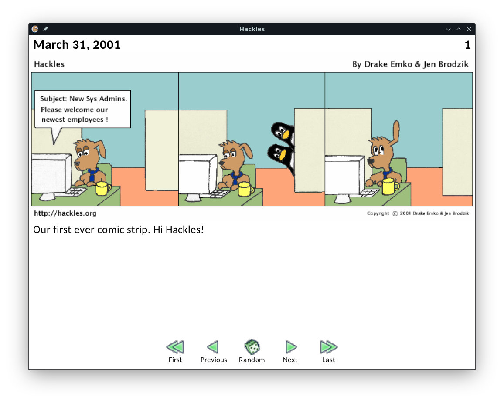

# Hackles

## About
[Hackles](http://web.archive.org/web/20091015091950/http://www.hackles.org/) is a web comic strip series created by [Drake Emko](http://web.archive.org/web/20091015094542/http://www.hackles.org/etc/drake.html) & [Jen Brodzik](http://web.archive.org/web/20091015094512/http://www.hackles.org/etc/jen.html), that features animals working in a big tech company called BitCo. The strip makes fun about situations that happen in the office and in the geek world. It was published online from March 31, 2001 to January 15, 2004. Below, you can read more about:

- [the authors](http://web.archive.org/web/20091015091950/http://www.hackles.org/authors.html)

- [the strip creation process](http://web.archive.org/web/20091015094111/http://www.hackles.org/etc/metamorph.html)


Unfortunately, hackles.org is no longer online, but you can still access the website through the [Wayback Machine](http://web.archive.org/web/20091015091950/http://www.hackles.org/).

## This project

This project aims to bring the Hackles comic strip to new audiences, while being a side-project I like working on to improve my programming skills. I used to read this comic in Brazilian Portuguese, translated by Marcelo Toscani Brandão, back in 2011, at the defunct [tirinhas.com](https://web.archive.org/web/20081014025043/http://www.tirinhas.com/) website. The icons used in the navigation buttons were retrieved from tirinhas.com as a tribute to the website that introduced me to this comic strip.

All the strips in this repository were retrieved from the archived hackles.org website.

The application presented here it's written in C and uses the Raylib library to do all the graphical stuff. [Raylib](https://www.raylib.com/) is a simple and ease-to-use library that is used to make videogames.

## How to run

### Compiling

First, install the required dependencies:

- openSUSE Tumbleweed
  ```bash
  zypper install make gcc libX11-devel Mesa-libGL-devel
  ```

- Debian-based distros
  ```bash
  apt install --no-install-recommends make libgl1-mesa-dev gcc libc6-dev
  ```

Clone the repository and compile the project:

```bash
git clone https://github.com/jpmsb/hackles
cd hackles
make
```

### Running

Just run the executable:

```bash
./hackles
```



## TODOs

This is a working in progress project. Here are some things that is planned to be done in the future:

 - Splash screen
 - About character screen
 - Proper hyperlink support
 - Multiple language switch support
 - Dark mode
 - Support for high resolution strips and navigation buttons